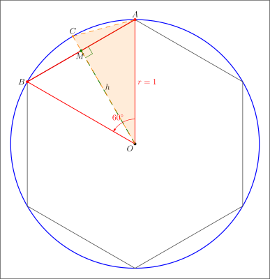

# 导论 微积分概览

对于中国的学生来说，非数学专业的「高等数学」课程即是对应「微积分」。与中学阶段研究常数的「初等数学」不同，微积分是研究变量的数学。「函数」是微积分研究的主要对象。在微积分教材开篇会再次介绍函数，不过这次给函数的定义更加严谨，以「映射」的方式给函数下定义。

「映射」的概念太抽象了，即便是从做题/考试出发，也没有要在这个概念上过多停留，函数的特性倒是值得我们去关注。微积分教材的题目经常是如下风格：

> 证明：已知 $ f(x) $ 在 $[a, b]$可导，求证 xxx 成立。

题目中的 $f(x)$ 是没有具体的表达式，读者要从`可导`条件出发，发掘出有用信息以便解题使用。这里 $f(x)$ 没有具体形式，就意味着，只要证明这个结论，就能解决一大堆的问题。


### 面积问题与穷竭法

教材中提到了古希腊人用「穷竭法」求取圆的面积，增加多边形的边数可以求取到更为精确的面积。具体怎么操作，书中并未展开。

回到两千多年前，数学工具远不如今天丰富。他们至少掌握以下的知识：

- 三角线面积
- 二等分角
- **特定角度**的正弦值，例如 $ \sin 30^{\circ} $
- 开根号求取近似值，例如 $ \sqrt{2} \approx 1.414 $

因此，穷竭法必须足够巧妙，简单。




```asy
import graph;
import geometry;

size(400);

// Define circle center and radius
pair O = (0, 0);
real r = 3;

// Draw circle
draw(circle(O, r), linewidth(1.2) + blue);

// Draw regular hexagon
path hexagon;
pair[] hexPoints;
for (int i = 0; i < 6; ++i) {
    hexPoints.push(r * dir(90 + i * 60));
}
hexagon = hexPoints[0];
for (int i = 1; i < 6; ++i) {
    hexagon = hexagon -- hexPoints[i];
}
hexagon = hexagon -- cycle;
draw(hexagon, linewidth(0.8) + gray(0.3));

// Mark center
dot(O, linewidth(4));
label("$O$", O, SW);

// Select one side of hexagon
pair A = hexPoints[0];  
pair B = hexPoints[1];
Label label_circle=Label("$r=1$");
draw(O -- A, L=  label_circle, linewidth(1) + red);
draw(O -- B, linewidth(1) + red);
draw(A -- B, linewidth(1.2) + red);

// Mark triangle vertices
dot(A, linewidth(4) + red);
dot(B, linewidth(4) + red);
label("$A$", A, dir(90));
label("$B$", B, dir(180));

// Draw height (median) of isosceles triangle OAB
pair M = (A + B) / 2;
draw(O -- M, linewidth(1) + deepgreen + dashed);
dot(M, linewidth(4) + deepgreen);
label("$M$", M, dir(260));

// Mark apothem
label("$h$", O + 0.6*(M-O), E + 0.2*N);

// Draw right angle mark at M
real marksize = 0.2;
pair dir1 = unit(O - M);
pair dir2 = unit(A - M);
draw(M + marksize*dir1 -- M + marksize*dir1 + marksize*dir2 -- M + marksize*dir2, linewidth(0.6) + deepgreen);

// Draw dodecagon segment
pair C = r * dir(90 + 30); // New vertex of regular 12-gon
draw(O -- C, linewidth(0.8) + orange + dashed);
draw(A -- C, linewidth(0.8) + orange + dashed);
dot(C, linewidth(3) + orange);
label("$C$", C, dir(90));

// Fill dodecagon segment (triangle OAC)
fill(O -- A -- C -- cycle, orange + opacity(0.15));

// Add angle mark at O between OA and OB
draw("$60^\circ$",arc(O, 0.6, degrees(A-O), degrees(B-O)), linewidth(0.6) + red, Arrow(4));
// label("$60^\circ$", O, NE);
shipout(bbox(0.5cm));
// Add border
// draw((-5, -7.2) -- (5, -7.2) -- (5, 4.5) -- (-5, 4.5) -- cycle, linewidth(0.5) + gray(0.7));
```

### 切线问题
